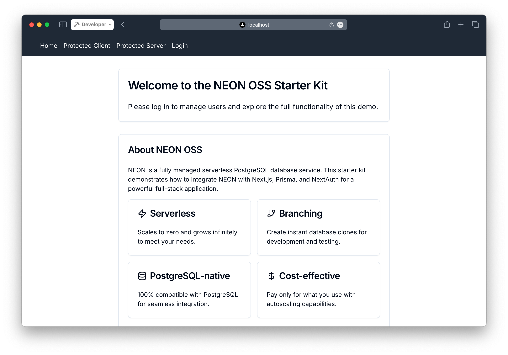
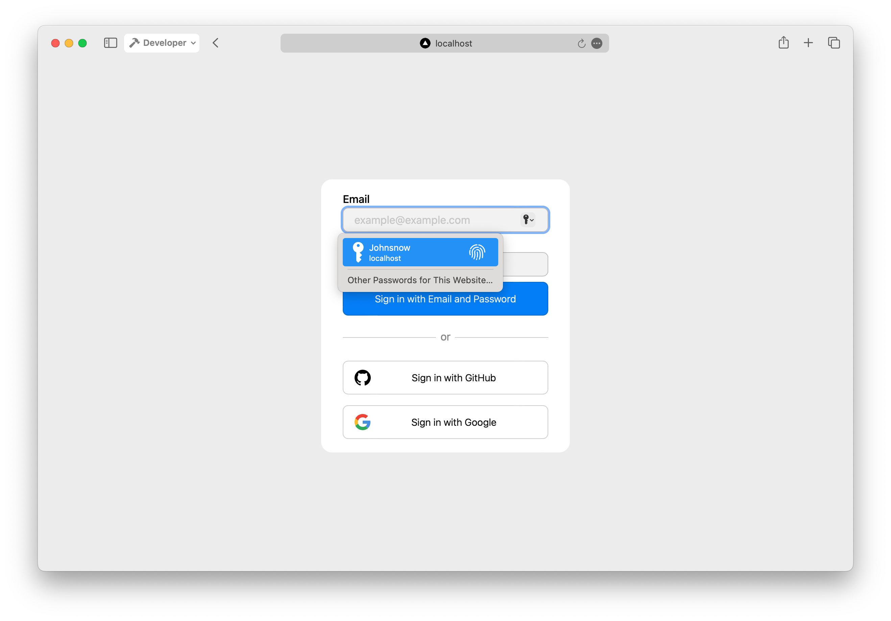
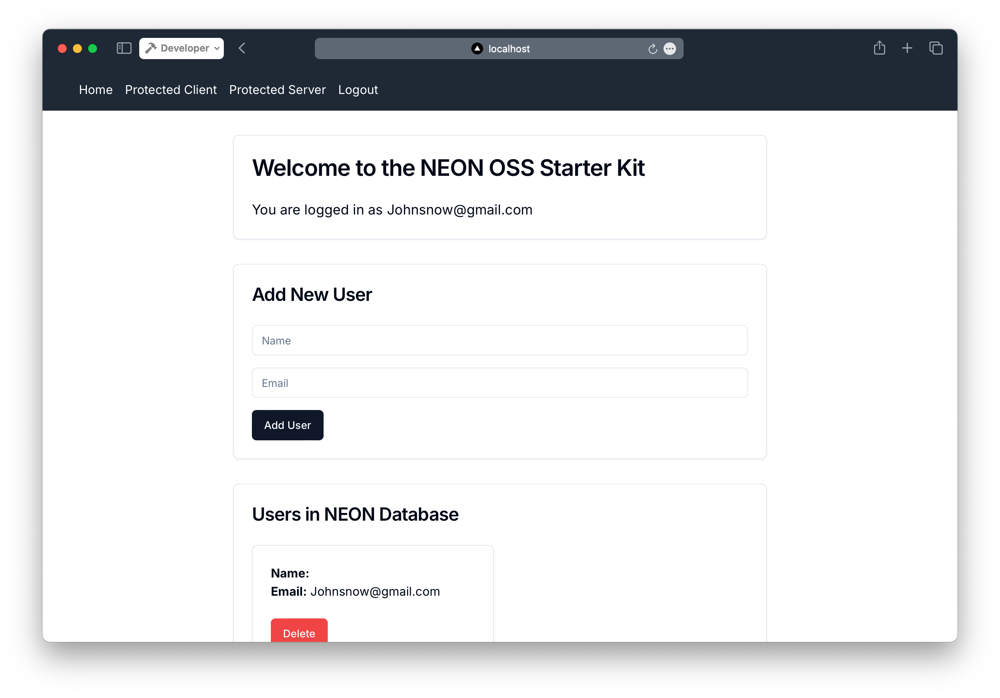

# NEON OSS Next.js Starter Kit

## Overview

The NEON OSS Starter Kit is a full-stack application template designed to help developers kickstart their projects with modern technologies. It features built-in user authentication, database management, and a fully responsive design, all powered by NEON, Next.js, Prisma, and Tailwind CSS. This starter kit is ideal for building scalable, serverless applications with ease, enabling you to focus on adding your unique features without worrying about the initial setup.

## Tech Stack

- **[Next.js 14](https://nextjs.org/)**: React framework for building web applications
- **[NEON](https://neon.tech/)**: Serverless PostgreSQL database
- **[Prisma](https://www.prisma.io/?via=spruce)**: Next-generation ORM for Node.js and TypeScript
- **[NextAuth v5](https://next-auth.js.org/)**: Authentication for Next.js
- **[shadcn/ui](https://ui.shadcn.com/)**: Re-usable components built with Radix UI and Tailwind CSS
- **[Tailwind CSS](https://tailwindcss.com/)**: Utility-first CSS framework

## Features

- **User Authentication**: Includes sign-up, login, and logout functionality with protected routes for both client-side and server-side authentication, leveraging NextAuth.js.
- **Database Management**: Integrated with Prisma for seamless interaction with the NEON PostgreSQL database, allowing for easy CRUD operations.
- **Responsive Design**: Optimized for all devices with built-in dark mode support, ensuring a consistent user experience across platforms.
- **Serverless Architecture**: Powered by NEON, the app scales automatically with zero configuration, providing a hassle-free environment for developers.
- **Reusable UI Components**: Pre-built with shadcn/ui and Tailwind CSS for rapid UI development and consistency across your application.
- **Environment Configuration**: Simplified setup with a `.env.local` file to manage all your environment variables securely.

## Getting Started

### Prerequisites

- Node.js 18+ and npm
- A NEON account (sign up at https://neon.tech if you don't have one)

### Quick Start

1. **Clone the repository:**

   ```bash
   git clone https://github.com/iamspruce/neon-oss-starter.git
   cd neon-oss-starter
   ```

2. **Install dependencies:**

   ```bash
   npm install
   # or
   yarn install
   ```

3. **Configure your environment:**

   - Copy `.env.example` to `.env.local`:

     ```bash
     cp .env.example .env.local
     ```

   - Update the `.env.local` file with your NEON database URL and other required values. You can find your NEON connection string in the NEON dashboard under your project settings.

4. **Run Prisma migrations:**

   ```bash
   npx prisma migrate dev
   ```

5. **Start the development server:**

   ```bash
   npm run dev
   # or
   yarn dev
   ```

6. **Access the app:**

   Open [http://localhost:3000](http://localhost:3000) in your browser to see the application in action.

## One-Click Deploy

Choose your preferred deployment platform:

- **Vercel**: [](https://vercel.com/import/project?template=https://github.com/iamspruce/neon-oss-starter)
- **Netlify**: [](https://app.netlify.com/start/deploy?repository=https://github.com/iamspruce/neon-oss-starter)
- **Heroku**: [](https://heroku.com/deploy?template=https://github.com/iamspruce/neon-oss-starter)

## Do It Yourself

This section provides a step-by-step guide to setting up the NEON OSS Starter from scratch. Follow these steps to install dependencies, set up the database, configure authentication, and more.

1. **Install Next.js:**
   First, install a new Next.js project by running the following command:

```bash
npx create-next-app@latest
```

When prompted, select "Yes" to use TypeScript, "Yes" to use TailwindCSS, and choose your preferred options for the other prompts.

2. **Create your NEON database:**

- Sign up for a NEON account at [https://neon.tech](https://neon.tech)
- Create a new project in the NEON console
- Once created, navigate to the "Connection Details" section
- Copy the connection string provided

3. **Set up your environment variables:**

- In your project root, create a `.env` file
- Add your NEON database URL:

```plaintext
DATABASE_URL="your-neon-connection-string"
```

4. **Install Prisma:**

```shellscript
npm install prisma --save-dev
```

5. **Initialize Prisma:**

```shellscript
npx prisma init
```

6. **Install NextAuth v5 and Prisma adapter:**

```shellscript
npm install next-auth@5.0.0-beta.20 @auth/prisma-adapter@2.4.2 @prisma/client@5.19.0
```

7. **Set up Prisma client:**
   Create a file `src/lib/prisma.ts`:

```typescript
import { PrismaClient } from "@prisma/client";

const globalForPrisma = globalThis as unknown as { prisma: PrismaClient };

export const prisma = globalForPrisma.prisma || new PrismaClient();

if (process.env.NODE_ENV !== "production") globalForPrisma.prisma = prisma;
```

8. **Set up authentication:**
   Create a file `src/auth/index.ts`:

```typescript
import NextAuth, { User, NextAuthConfig } from "next-auth";
import CredentialsProvider from "next-auth/providers/credentials";
import GithubProvider from "next-auth/providers/github";
import GoogleProvider from "next-auth/providers/google";
import { PrismaAdapter } from "@auth/prisma-adapter";
import { prisma } from "../lib/prisma";

const authOptions: NextAuthConfig = {
  session: {
    strategy: "jwt",
  },
  adapter: PrismaAdapter(prisma),
  providers: [
    CredentialsProvider({
      name: "Email and Password",
      credentials: {
        email: {
          label: "Email",
          type: "email",
          placeholder: "example@example.com",
        },
        password: { label: "Password", type: "password" },
      },
      async authorize(credentials): Promise<User | null> {
        if (
          !credentials ||
          typeof credentials.email !== "string" ||
          typeof credentials.password !== "string"
        ) {
          throw new Error("Invalid credentials.");
        }

        let user = await prisma.user.findUnique({
          where: {
            email: credentials.email,
          },
        });

        if (!user) {
          user = await prisma.user.create({
            data: {
              email: credentials.email,
            },
          });
        }

        return user;
      },
    }),
    GithubProvider({
      clientId: process.env.GITHUB_ID,
      clientSecret: process.env.GITHUB_SECRET,
    }),
    GoogleProvider({
      clientId: process.env.GOOGLE_ID,
      clientSecret: process.env.GOOGLE_SECRET,
    }),
  ],
  secret: process.env.AUTH_SECRET,
};

export const { auth, handlers, signIn, signOut } = NextAuth(authOptions);
```

9. **Add a route handler for NextAuth:**
   Create a file `app/api/auth/[...nextauth]/route.ts`:

```typescript
import { handlers } from "@/auth";

export const { GET, POST } = handlers;
```

10. **Create your Prisma schema:**
    Update `prisma/schema.prisma`:

```plaintext
generator client {
  provider = "prisma-client-js"
}

datasource db {
  provider = "postgresql"
  url      = env("DATABASE_URL")
}

model User {
  id            String    @id @default(cuid())
  name          String?
  email         String    @unique
  emailVerified DateTime?
  image         String?
  accounts      Account[]
  sessions      Session[]
  createdAt     DateTime  @default(now())
  updatedAt     DateTime  @updatedAt
}

model Account {
  userId            String
  type              String
  provider          String
  providerAccountId String
  refresh_token     String?
  access_token      String?
  expires_at        Int?
  token_type        String?
  scope             String?
  id_token          String?
  session_state     String?
  createdAt         DateTime @default(now())
  updatedAt         DateTime @updatedAt
  user              User     @relation(fields: [userId], references: [id], onDelete: Cascade)

  @@id([provider, providerAccountId])
}

model Session {
  sessionToken String   @unique
  userId       String
  expires      DateTime
  user         User     @relation(fields: [userId], references: [id], onDelete: Cascade)
  createdAt    DateTime @default(now())
  updatedAt    DateTime @updatedAt
}

model VerificationToken {
  identifier String
  token      String
  expires    DateTime

  @@id([identifier, token])
}
```

11. **Generate Prisma client:**

```shellscript
npx prisma generate
```

12. **Apply the schema (create migration):**

```shellscript
npx prisma migrate dev
```

13. **Wrap components with SessionProvider:**
    Update `src/app/layout.tsx`:

```typescriptreact
import type { Metadata } from "next";
import { Inter as FontSans } from "next/font/google";
import "../styles/globals.css";
import { Toaster } from "@/components/ui/toaster";
import { auth } from "@/auth";
import { SessionProvider } from "next-auth/react";
import { cn } from "@/lib/utils";
import Header from "@/components/Header";

const fontSans = FontSans({
  subsets: ["latin"],
  variable: "--font-sans",
});

export const metadata: Metadata = {
  title: "NEON OSS NEXTJS",
  description: "NEON OSS NEXTJS STARTER TEMPLATE",
};

export default async function RootLayout({
  children,
}: Readonly<{
  children: React.ReactNode;
}>) {
  const session = await auth();

  return (
    <SessionProvider session={session}>
      <html lang="en">
        <body
          className={cn(
            "min-h-screen bg-background font-sans antialiased",
            fontSans.variable
          )}
        >
          <Header />
          <main className="container">{children}</main>
          <Toaster />
        </body>
      </html>
    </SessionProvider>
  );
}
```

14. **Create protected client page:**
    Create `src/app/protected-client/page.tsx`:

```typescriptreact
"use client";

import { useSession } from "next-auth/react";
import { useRouter } from "next/navigation";
import { useEffect } from "react";

export default function ProtectedClientPage() {
  const { data: session, status } = useSession();
  const router = useRouter();

  useEffect(() => {
    if (status === "unauthenticated") {
      router.push("/api/auth/signin");
    }
  }, [status, router]);

  if (status === "loading") {
    return <div>Loading...</div>;
  }

  if (!session) {
    return null;
  }

  return (
    <div>
      <h1 className="text-2xl font-bold mb-4">Protected Client Page</h1>
      <p>You can only see this page if you are logged in.</p>
    </div>
  );
}
```

15. **Create protected server page:**
    Create `src/app/protected-server/page.tsx`:

```typescriptreact
import { auth } from "@/auth";
import { redirect } from "next/navigation";

export default async function ProtectedServerPage() {
  const session = await auth();

  if (!session) {
    redirect("/api/auth/signin");
  }

  return (
    <div>
      <h1 className="text-2xl font-bold mb-4">Protected Server Page</h1>
      <p>You can only see this page if you are logged in.</p>
      <p>This page is protected on the server side.</p>
    </div>
  );
}
```

16. **Create Header component:**
    Create `src/components/Header.tsx`:

```typescriptreact
import { auth } from "@/auth";
import Link from "next/link";

export default async function Header() {
  const session = await auth();
  return (
    <header className="bg-gray-800 text-white ">
      <div className="container">
        <nav className="p-4">
          <ul className="flex space-x-4">
            <li>
              <Link href="/">Home</Link>
            </li>
            <li>
              <Link href="/protected-client">Protected Client</Link>
            </li>
            <li>
              <Link href="/protected-server">Protected Server</Link>
            </li>
            {session ? (
              <li>
                <Link href="/api/auth/signout">Logout</Link>
              </li>
            ) : (
              <li>
                <Link href="/api/auth/signin">Login</Link>
              </li>
            )}
          </ul>
        </nav>
      </div>
    </header>
  );
}
```

17. **Install and set up shadcn/ui:**

```shellscript
npx shadcn-ui@latest init
```

Follow the prompts to set up shadcn/ui. This will update your `tailwind.config.js` and add necessary configurations.

After initialization, you can add components as needed:

```shellscript
npx shadcn-ui@latest add button
npx shadcn-ui@latest add card
npx shadcn-ui@latest add input
# Add more components as needed
```

18. **Update your pages and components to use shadcn/ui components.**
19. **Start the development server:**

```shellscript
npm run dev
```

Your NEON OSS Next.js starter should now be up and running with authentication, protected routes, and a basic UI using shadcn/ui components.

## Deployment

This starter kit is optimized for deployment on Vercel, leveraging its seamless integration with Next.js and NEON's serverless PostgreSQL. However, you can deploy to other platforms that support Node.js applications.

### Deploying to Vercel (Recommended)

1. **Connect your repository:**

   - Fork this repository to your GitHub account.
   - Sign up or log in to [Vercel](https://vercel.com).
   - Click "New Project" and select your forked repository.

2. **Configure your project:**

   - Vercel will automatically detect that you're using Next.js.
   - In the "Environment Variables" section, add all variables from your `.env.local` file:
     - `DATABASE_URL`: Your NEON database connection string
     - `AUTH_SECRET`: A secure random string for NextAuth
     - `GITHUB_ID` and `GITHUB_SECRET`: If using GitHub authentication
     - `GOOGLE_ID` and `GOOGLE_SECRET`: If using Google authentication

3. **Deploy:**

   - Click "Deploy" and wait for the build to complete.
   - Vercel will provide you with a deployment URL.

4. **Set up NEON for production:**

   - In your NEON dashboard, create a new branch for production.
   - Update the `DATABASE_URL` in your Vercel project settings with the new production branch URL.

5. **Enjoy your deployed application:**
   - Visit your Vercel deployment URL to see your live application.
   - Your app now benefits from Vercel's global CDN and NEON's serverless database scaling.

### Alternative Deployment Options

While Vercel offers the smoothest experience, you can deploy to other platforms:

- **Railway**: Offers easy PostgreSQL setup and deployment.

  1. Create a new project on Railway.
  2. Add a PostgreSQL database to your project.
  3. Connect your GitHub repository.
  4. Set up environment variables in the Railway dashboard.
  5. Deploy your application.

- **Heroku**: Supports Node.js applications and offers a PostgreSQL add-on.
  1. Create a new app on Heroku.
  2. Connect your GitHub repository.
  3. Add the Heroku Postgres add-on.
  4. Set up config vars in the Heroku dashboard.
  5. Deploy your application using the Heroku CLI or GitHub integration.

Remember to update your `DATABASE_URL` and other environment variables according to your chosen hosting provider's guidelines.

## Screenshots





## Live Demo

Check out the live demo at: [https://neon-oss-starter.vercel.app](https://neon-oss-starter.vercel.app)

## Contributing

We welcome contributions from the community! Whether it's fixing a bug, adding new features, or improving documentation, your input is valuable. Please follow these steps to contribute:

1. Fork the repository
2. Create a new branch (`git checkout -b feature/your-feature`)
3. Make your changes and commit them (`git commit -m 'Add some feature'`)
4. Push to the branch (`git push origin feature/your-feature`)
5. Open a Pull Request

We review all contributions and appreciate your efforts to improve this project!

## License

This project is licensed under the MIT License. See the [LICENSE](LICENSE) file for more details.

## Acknowledgements

- [NEON](https://neon.tech/) for providing a top-notch serverless PostgreSQL solution.
- [Vercel](https://vercel.com/) for the Next.js framework and seamless deployment experience.
- [Prisma](https://www.prisma.io/?via=spruce) for making database management a breeze.
- [NextAuth.js](https://next-auth.js.org/) for simplifying authentication in Next.js.
- [shadcn/ui](https://ui.shadcn.com/) for the elegant and reusable UI components.
- All the open-source projects and contributors who made this starter kit possible.
